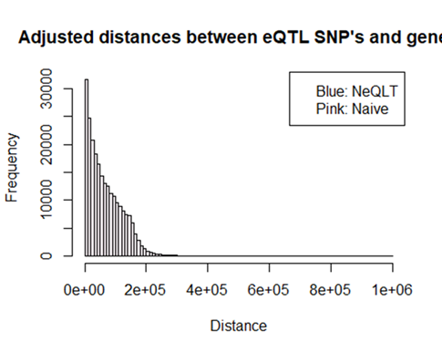
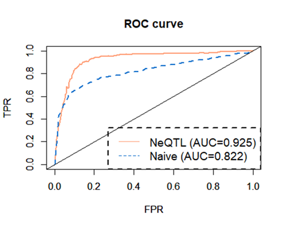

NeQTL
================
Jiwoong Kim (University of South Florida), Jiaxin Yang (Amazon),
Jianrong Wang (Michigan State University)

# Table of Contents

1.  Introduction to NeQTL
2.  Data
3.  Executing NeQTL
4.  Evaluating NeQTL’s performance
5.  Further analysis using the posterior probability
6.  Reference

# 1. Introduction to NeQTL

## 1.1 Background

Changes in gene expression has been shown to play a crucial role in
human disease. Expression quantitative trait locus (eQTL) mapping
investigates how single nucleotide polymorphisms (SNPs) can affect the
gene expression.1-6 Even though recent studies7-12 demonstrate that
eQTL-SNPs (eSNPs) tend to clump together in clusters near target genes
and regulate a common gene, many extant methods still presume one-to-one
regulatory relationship between a gene and a SNP, which constrains
furtherance of analysis of underlying SNP-gene-relationship and eQTL
mapping. For example, one classical method – which is referred to as the
“traditional” method – for prediction of an eSNP is to use an eQTL score
of a corresponding SNP: any SNP is chosen as a putative eSNP if its
score is larger than a threshold. The limitation of the traditional
method is clearly evident if one considers the possibility that a
practitioner might inadvertently exclude a true eSNP from the selection
just because it displays a low eQTL score. As shown later, some SNPs
with a low eQTL score turn out to be indeed eSNPs: it transpires that
these eSNP with a low score build a certain relationship – neighboring
relationship which will be introduced later – to each other and regulate
the target gene. Addressing this limitation, a new approach that a group
of SNPs, rather than a single SNP, regulate a common gene has been
gaining currency recently. Moving pari passu with this new approach, the
first question this study seeks to answer is the following: if an
enhancer interacts with a specific gene, is a SNP residing within the
enhancer possibly an eSNP which regulates the expression of the same
gene? Intriguingly, a recent study13 demonstrates genes reveal higher
expression levels when multiple enhancers regulate transcription start
sites (TSSs) than would otherwise be the case. Motivated by this study,
another question of interest is the following: if an enhancer includes
an eSNP, is it more likely that the same enhancer interacts with the
target gene? In an effort to answer those two questions, we aim to
predict eQTL and chromatin interaction simultaneously.

## 1.2 Schematic diagram

    ## Warning in normalizePath(path.expand(path), winslash, mustWork):
    ## path[1]="C:/Users/ji_wo/Documents/R1/NeQTL/src/../inst/include": The system
    ## cannot find the path specified


## 1.3 Where to download the Package

The package can be downloaded in GitHub:
[github.com/wangjr03/NeQTL](github.com/wangjr03/NeQTL)

# 2 Data

## 2.1 Input Dataset

Input data in a data-frame structure should include the following
variables for further analysis:

- `chr`: the chromosome where SNP is located.
- `gene_id`: the ensemble gene id.
- `enh_start`: the enhancer starting point.
- `enh_end`: the enhancer ending point.
- `distance`: the distance between a SNP and an associated gene.
- `qk`: the eQTL status ($q_{k}$) of the *k*th SNP. `qk=1` if the SNP is
  an eQTL and 0 otherwise.  
- `lk`: the chromatin interaction status ($l_{k}$) of the *k*th SNP.
  `lk=1` if the SNP has a chromatin interaction and 0 otherwise.  
- `skq`: the eQTL score ($s_{k}^{q}$).
- `skl`: the chromatin interaction score ($s_{k}^{l}$).

The following shows the example of valid input data:

``` r
Valid_Data = List_Example_Data$Valid_Input
head(Valid_Data)
```

    ##        chr         gene_id enh_start   enh_end distance Gene_Activity
    ## 662  chr20 ENSG00000000419  49437000  49438800  -137520            45
    ## 865  chr20 ENSG00000000419  50017600  50022000   446880            45
    ## 1150 chr20 ENSG00000000419  50125600  50129200   550765            45
    ## 2707  chr1 ENSG00000000460 169666200 169673600    39211             3
    ## 3494  chr1 ENSG00000000938  28566400  28567000   604952             3
    ## 5798  chr6 ENSG00000001167  41163600  41166200   125017            24
    ##      Enh_Activity Correlation qk lk          skl        skq
    ## 662             2  0.13515046  0  0 9.046135e-02 0.20701541
    ## 865             1  0.03785434  1  0 6.815785e-06 0.88261932
    ## 1150            1  0.05378253  1  0 2.718569e-07 0.76887717
    ## 2707            1  0.03848184  1  1 6.826344e-01 2.50072955
    ## 3494            1 -0.07008534  0  0 5.216202e-08 0.06540107
    ## 5798            9  0.43323148  0  0 1.287507e-01 0.27535636

``` r
Check_Variable(Valid_Data)
```

    ## [1] "Good to go!"

    ## [1] 1

If an input data misses any of required variables, an error will be
returned, and execution will be halted. Use the “Check_Variable()”
function.

``` r
Invalid1 = List_Example_Data$Invalid_Input1
Check_Variable(Invalid1)
```

    ## [1] "gene_id  is missing."
    ## [1] ""

    ## [1] 0

When input data includes any NA, another error message will be returned,
and execution will be halted.

``` r
Invalid2 = List_Example_Data$Invalid_Input2
Check_Variable(Invalid2)
```

    ## [1] "There is NA in the dataset."
    ## [1] "Variables and indices of NA's in the variables"
    ## $enh_start
    ##   [1]  18  60  61  65  68  73  74 105 126 130 137 138 151 157 161 162 192 195
    ##  [19] 203 223 234 235 244 263 267 278 281 287 318 325 333 352 354 366 372 375
    ##  [37] 380 388 404 411 413 416 419 420 434 435 442 448 472 479 482 496 500 511
    ##  [55] 524 533 544 546 573 577 604 618 623 626 637 639 646 649 662 666 671 682
    ##  [73] 684 718 724 725 726 730 743 748 752 754 755 759 774 786 804 814 881 884
    ##  [91] 894 900 931 938 940 961 978 986 988 995

    ## [1] 0

## 2.2 Other Dataset

In the “data” folder of the package, the following can be found. For
more details, please see the description files or .

- `DistVec`

- `List_Acc_Example`

- `List_Example_Data`

- `List_Gold_Label`

- `List_Modified_Gold_Label`

- `List_Naive_Bayes`

- `List_NeQTL`

Use `data()` to import the above dataset: e.g., `data(List_Gold_Label)`.

# 3. Executing NeQTL

## 3.1 Description

NeQTL uses a Gibbs sampling algorithm and is designed to provide a
practitioner with solutions for both eQTL and Chromatin interaction
analysis.

## 3.2 Usage

`Run_NeQTL2(Input_Data, qR = 0.1, lR = 0.1, b_gen_skl=FALSE, b_use_lNk=FALSE, total_iter=100, bDisp=FALSE)`

## 3.3 Arguments

- `Input_Data`: a data frame which information of gene, chromosome,
  enhancer, etc. Refer to **Section 2.1**.

- `b_gen_skl`: option for generating the chromatin interaction scores
  (`skl`) internally. Default is FALSE. To use this option, the input
  data should include “Gene_Activity”, “Enh_Activity”, and
  “Correlation”: see `Generate_skl()`. Using option, a better `skl`
  based on our findings will be generated.

- `b_use_lNk`: option for incorporating a neighboring relationship for
  chromatin interaction. Default is FALSE.

- `qR`: the threshold ratio for $q_{k}$ (eQTL status index). For
  example, if $s_{k}^{q}$ (eQTL score) is greater than
  `(1-qR)`$\times100$ percentile of the entire values, then $q_{k}=1$,
  that is, the $k$th SNP is an eQTL. 0.1 is the default value.

- `lR`: the threshold ratio for $l_{k}$ (chromatin interaction status
  index). For example, if $s_{k}^{l}$ (chromatin interaction score) is
  greater than `(1-lR)`$\times100$ percentile of the entire values, then
  $l_{k}=1$, that is, the $k$th SNP has the chromatin interaction. 0.1
  is the default value.

- `total_iter`: the number of iterations of the Gibbs sampling. 100 is
  the default value.

- `bDisp`: option to show the progress of the iterations. False is the
  default value.

## 3.3 Return value

A list of the following variables will be returned:

Indices

- `lk_index`: indices of SNPs whose $l_{k}=1$
- `qk_index`: indices of SNPs whose $q_{k}=1$

Probabilities

- `prob_qk1_all`: a $K\times 1$ vector of $P(q_{k}=1)$, that is, a
  vector of probabilities of the $k$th SNP being an eQTL.
- `prob_lk1_all`: a $K\times 1$ vector of $P(l_{k}=1)$, that is, a
  vector of probabilities of the $k$th SNP having a chromatin
  interaction.

Posterior probabilities

- `skq_qk0lk0`: $P(s_{k}^{q}=s|q_{k}=0, l_{k}=0)$
- `skq_qk0lk1`: $P(s_{k}^{q}=s|q_{k}=0, l_{k}=1)$
- `skq_qk1lk0`: $P(s_{k}^{q}=s|q_{k}=1, l_{k}=0)$
- `skq_qk1lk1`: $P(s_{k}^{q}=s|q_{k}=1, l_{k}=1)$
- `skl_qk0lk0`: $P(s_{k}^{l}=s|q_{k}=0, l_{k}=0)$
- `skl_qk0lk1`: $P(s_{k}^{l}=s|q_{k}=0, l_{k}=1)$
- `skl_qk1lk0`: $P(s_{k}^{l}=s|q_{k}=1, l_{k}=0)$
- `skl_qk1lk1`: $P(s_{k}^{l}=s|q_{k}=1, l_{k}=1)$

## 3.4 Examples

``` r
########

lst = Run_NeQTL2(Valid_Data, qR = 0.1, lR = 0.1, b_gen_skl=FALSE, b_use_lNk=FALSE, total_iter=10, bDisp=FALSE)
```

    ## [1] "Good to go!"
    ## [1] "start iteration: 1"
    ## [1] "1 iterations are finished.\n"
    ## [1] "start iteration: 2"
    ## [1] "2 iterations are finished.\n"
    ## [1] "start iteration: 3"
    ## [1] "3 iterations are finished.\n"
    ## [1] "start iteration: 4"
    ## [1] "4 iterations are finished.\n"
    ## [1] "start iteration: 5"
    ## [1] "5 iterations are finished.\n"
    ## [1] "start iteration: 6"
    ## [1] "6 iterations are finished.\n"
    ## [1] "start iteration: 7"
    ## [1] "7 iterations are finished.\n"
    ## [1] "start iteration: 8"
    ## [1] "8 iterations are finished.\n"
    ## [1] "start iteration: 9"
    ## [1] "9 iterations are finished.\n"
    ## [1] "start iteration: 10"
    ## [1] "10 iterations are finished.\n"

# 4. Evaluation of NeQTL’s performance

## 4.1 AUC

This section will illustrate how to compute AUC’s of NeQTL and Naive
Bayesian method: `muther_eqtl` gold label will be used for computing
AUC. For this example, recall lists of $q_{k}$ indices obtained by NeQTL
and Naive Bayesian: use `data(List_Modified_Gold_Label)`,
`data(List_NeQTL)` and `data(List_Naive_Bayes)`.

``` r
## Here gold_label is muther_eqtl. 

df = cbind("gold_label"=gold_label, "NeQTL"=Prob_NeQTL_qk, "Naive"=Prob_Naive_qk)
df = data.frame(df)


# NeQTL's auc
pred  = prediction(df$NeQTL, df$gold_label)
perf  = performance(pred, "tpr", "fpr")
auc_b = performance(pred, 'auc')
auc_b = unlist(slot(auc_b,"y.values"))
auc_b =  round(auc_b, digits=3)
plot(perf, xlim=c(0,1), ylim=c(0,1), col=colvec[1], main=paste("ROC curve of eQTL prediction"), lty=ltyvec[1], lwd = 2)

print("AUC of NeQTL is")
```

    ## [1] "AUC of NeQTL is"

``` r
print(auc_b)
```

    ## [1] 0.918

``` r
# Naive Bayesian
pred  = prediction(df$Naive, df$gold_label)
perf  = performance(pred, "tpr", "fpr")
auc_t = performance(pred, 'auc')
auc_t = unlist(slot(auc_t, "y.values"))
auc_t =  round(auc_t, digits=3)

print("AUC of Naive Bayesian is")
```

    ## [1] "AUC of Naive Bayesian is"

``` r
print(auc_t)
```

    ## [1] 0.777

``` r
par(new=TRUE)
plot(perf, xlim=c(0,1), ylim=c(0,1), col=colvec[2], lty=ltyvec[2], lwd = 2)

legendstr1 = paste0("NeQTL (", auc_b, ")")
legendstr2 = paste0("Naive (", auc_t, ")")

legend("bottomright", legend = c(legendstr1, legendstr2),
       col = c(colvec[1], colvec[2]), lty=c(ltyvec[1], ltyvec[2]), cex=cexval, lwd=lwdval, box.lty=2, box.lwd=2)

abline(0,1)
```

<!-- -->

``` r
png_path_auc1 = paste(CurDir, "/AUC1.png", sep="")
knitr::include_graphics(png_path_auc1)
```


## 4.2 Distance adjustment

For the fair comparison of methods for the eQTL and chromatin
interaction analyses, the distance between SNP and gene should be
adjusted. Use `data(Real_Input_Data)` to recall the real example data.

``` r
data(DistVec)
```

    ## Warning in data(DistVec): data set 'DistVec' not found

``` r
percent = 0.05
   

lst = Dist_SNP_Gene(Prob_NeQTL_qk, DistVec, percent)
Dist_SNP_Gene_NeQTL = lst$Dist_eQTL_Gene
Threshold_NeQTL = lst$ProbVal


lst = Dist_SNP_Gene(Prob_Naive_qk, DistVec, percent)
Dist_SNP_Gene_Naive = lst$Dist_eQTL_Gene
Threshold_Naive = lst$ProbVal

summary(Prob_Naive_qk)
```

    ##      Min.   1st Qu.    Median      Mean   3rd Qu.      Max. 
    ## 0.0001175 0.0003484 0.0015214 0.0757893 0.0115015 1.0000000

``` r
summary(Prob_NeQTL_qk)
```

    ##    Min. 1st Qu.  Median    Mean 3rd Qu.    Max. 
    ## 0.00000 0.00000 0.00001 0.05637 0.00922 1.00000

``` r
xlabstr="Distance"
mainstr="Distances between eQTL SNP's and genes"
legend_vec=c("Blue: NeQLT", "Pink: Naive")

GetHist2(Dist_SNP_Gene_NeQTL, Dist_SNP_Gene_Naive, mainstr, legend_vec)
```

<!-- -->


As seen in the above histogram, NeQTL tends to detect a SNP as an eQTL
when it is located closer to an associated gene while Naive Bayesian
method detects it regardless of the distance between a SNP and a gene.
Next histogram reports a result after distances between SNPs and genes
are adjusted.

``` r
lst = Dist_SNP_Gene(Prob_Naive_qk, DistVec, percent)
Dist_SNP_Gene_Naive = lst$Dist_eQTL_Gene
Threshold_Naive = lst$ProbVal

#data(List_Gold_Label)
gold_label = List_Modified_Gold_Label$muther_eqtl     ### Use Muther eQTL data


lst = Balancing_Dist(DistVec, Dist_SNP_Gene_NeQTL, Dist_SNP_Gene_Naive, Prob_NeQTL_qk, Prob_Naive_qk, Threshold_NeQTL, Threshold_Naive, gold_label)

Adj_Dist_NeQTL = lst$Adj_Dist1
Adj_Dist_Naive = lst$Adj_Dist2
 

mainstr="Adjusted distances between eQTL SNP's and genes"
legendstr=c("Blue: NeQLT", "Pink: Naive")

GetHist2(Adj_Dist_NeQTL, Adj_Dist_Naive, mainstr=mainstr, legendstr=legendstr)
```

<!-- -->



When comparing two different methods (that is, NeQTL vs antother
method), we will first adjust the distances between eQTL SNP’s (detected
by attempted methods) and their associated genes. To that end, we will
compute true positive (TP), false positive (FP), true negative (TN) and
false negative (FN) corresponding to using $(1-pR)\times 100$ percentile
of posterior probabilities of being eQTL – obtained after execution of
`Run_NeQTL()` – as a threshold to detect eQTL SNP’s.

``` r
##### Recall muther_eqtl gold label
gold_label = List_Gold_Label$muther_eqtl


### Get accuracy measures (TP, FP, TN, FN) of NeQTL and Naive Bayesian methods
### Run Compute_Accuracy() after removing "#". The example results (Acc_NeQTL and Acc_Naive) can also be found in the data folder of the package: call data(List_Acc_Example), ACC_NeQTL=List_Acc_Example$Accuracy_Mat1, and ACC_Naive=List_Acc_Example$Accuracy_Mat2

#List_Acc_Example = Compute_Accuracy(DistVec, Prob_NeQTL_qk, Prob_Naive_qk, bDisp=FALSE)


Acc_NeQTL = List_Acc_Example$Accuracy_Mat1
Acc_Naive = List_Acc_Example$Accuracy_Mat2

head(Acc_NeQTL)
```

    ##       TP     FP  FN      TN
    ## [1,]  94  79128 322 8557820
    ## [2,]  92 107554 268 8471428
    ## [3,] 114 168370 230 8385020
    ## [4,] 109 200873 207 8298597
    ## [5,] 119 234012 186 8212172
    ## [6,] 124 265149 169 8125743

``` r
tail(Acc_NeQTL)
```

    ##         TP      FP FN     TN
    ##  [95,] 415 8141028  0 432229
    ##  [96,] 420 8227459  0 345784
    ##  [97,] 419 8313400  0 259332
    ##  [98,] 422 8471276  0 172890
    ##  [99,] 422 8557720  0  86446
    ## [100,] 422 8644166  0      0

``` r
head(Acc_Naive)
```

    ##       TP     FP  FN      TN
    ## [1,]  75  79146 338 8475255
    ## [2,]  83 107562 334 8468619
    ## [3,] 163 168321 249 8383170
    ## [4,] 180 200802 234 8298097
    ## [5,] 188 233943 225 8207505
    ## [6,] 193 265079 222 8122353

``` r
tail(Acc_Naive)
```

    ##         TP      FP FN     TN
    ##  [95,] 416 8141027  6 229357
    ##  [96,] 416 8227463  6 229357
    ##  [97,] 416 8313403  6 229357
    ##  [98,] 422 8471276  0      0
    ##  [99,] 422 8557720  0      0
    ## [100,] 422 8644166  0      0

Using these two adjusted accuracy matrices, we draw adjusted ROC curves
of NeQTL and Naive Bayesian methods: use
`Draw_Adjusted_ROC(Accuracy_Mat1, Accuracy_Mat2, method_name1, method_name2)`

``` r
Draw_Adjusted_ROC(Acc_NeQTL, Acc_Naive, "NeQTL", "Naive")
```

<!-- -->



# 5. Further analysis using the posterior probability


The posterior probability can be a good proxy to detect genes relevant
to the disease, i.e., the posterior probability can be used to detect
genes. The figure summarizes the comprehensive result that we found
after utilizing the posterior probabilities obtained from the
application of NeQTL to the leukemia dataset. The circle plot shows
aggregate posterior probabilities (blue bar) of various genes on
chromosome 1. Red curves (below blue bar), which connect genes, imply
that those genes are, to some extent, associated through sharing the
same eSNP. For example, TNFRSF18 is associated with 10 other genes
(CPSF3L, SDF4, AL139287.1, CPTP, TNFRSF4, 3GALT6, PUSL1, SCNN1D, UBE2J2,
ACAP3) through sharing common eSNPs (rs11804831, rs11260535,
rs796333038, rs80042932, rs58980341, rs9729550, rs113462938, rs74491544,
rs142609243) as shown in the enlarged image (top left of the figure):
other two enlarged images show networks whose centers are CD52 and
CD101.

# References
